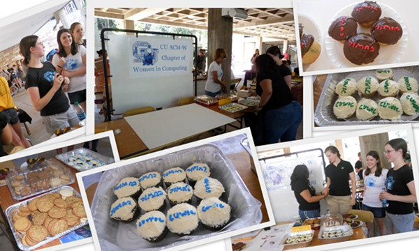
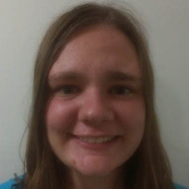

# Women in Computing Website
### Last Edit: 10/26/2014
##### Originally Created By: Ashley Herbertson and Andrea Sassu

##Guide to Updating

###Adding Events to Events Page

To manually add an event to the *events.php* page, add the following code to it's corresponding section (either upcoming or past events). The code is the same for both sections. This way, you can simply cut the event information from Upcoming Events to Past Events.

```HTML
<div class="new-event">
	<h2>EVENT NAME</h2>
	<p><span class="bold">Time:</span> Thursday, October 9th, 2014: 10:00am-12:00pm</p>
	<p><span class="bold">Location:</span> ECOT 831</p>
	<p>I am a description!</p>
	<!--Optional Image (commented out by default)
		<p></p>
	-->
</div>
```

###Changing the Banner Image

The banner image is determined within the style.css file. It is a background image set to cover the entire banner size (determined in the same spot). This means that your banner image can be whatever size you wish, but smaller images will become pixilated if the quality isn't high enough. To edit this, find the *main-image* class in *style.css*:
```CSS
#main-image{
	width: 100%;
	height: 400px;
	background: url(/images/engineering-center2.jpg); 
	background-position: 50% 50%;
	background-size: cover;

}
```

###Adding Officers

The officer slider follows the following format. To add a new officer, copy the entire section of code and replace the correct information on *index.php*:

Note: the officer image sizes are currently 300x300px. Descriptions should be less than 370 characters long.

```HTML
<span>
	<div class="staff-info">
		<h3>FIRSTNAME LASTNAME</h3>
		<h4>ROLE</h4>
		<p class="email">E-Mail: <a href="#">EMAIL</a></p>
		<p class="staff-description">DESCRIPTION</p>
	</div> 
</span>
```

###Updating the Header and Footer

All three pages of the website (*index.php*, *events.php*, and *scholarships.php*) reference the same header and footer files. If you wish to make a change to these files, or change the overall layout to the website, then you must edit *layout/header.php* and *layout/footer.php*, respectively. If you make a change in one of these files, it will change on every page of the website.

Information that may need to be updated: Link order/adding pages, the group e-mail, phone number, and address, sponsors images, etc.

##Additional Notes

###Google Calendar & Facebook Plugins on Main Page

The Events section on the main page is solely made up of the iframe plugins designed by Google and Facebook, respectively. Some browsers allow for plugins that will automatically block iframes from loading, leaving a blank square. This may also happen if the plugin is down on the host website. There is no way around this, but it's something to be aware of.